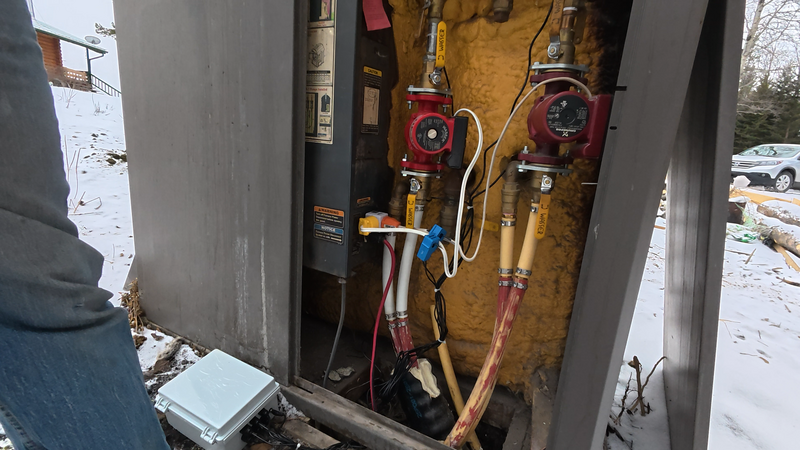
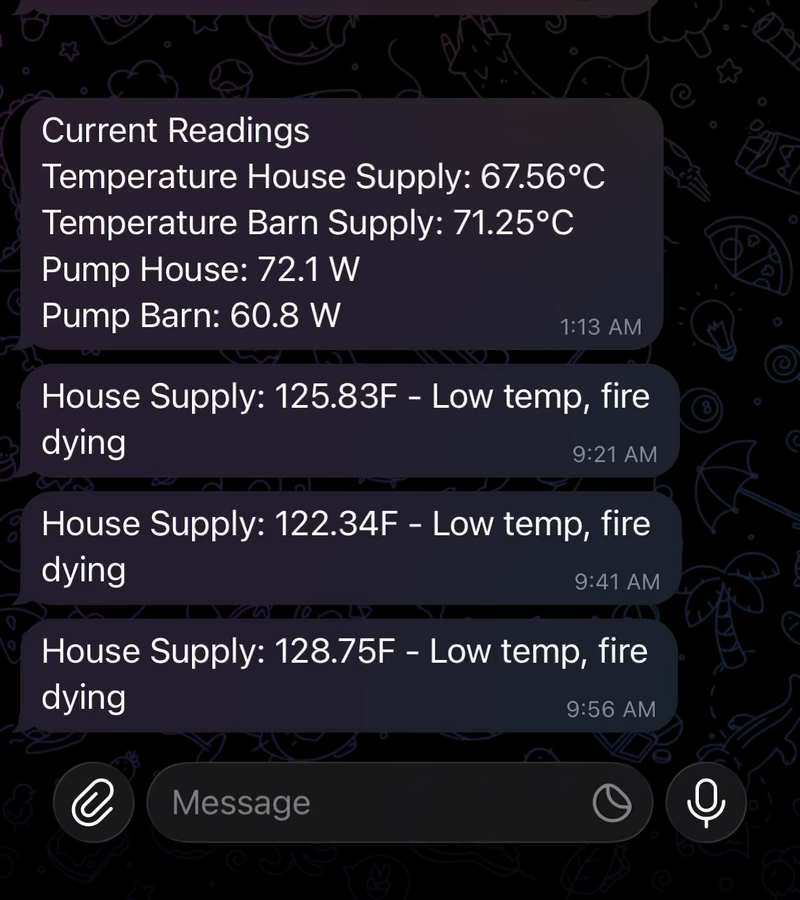

# thesada-fw

Know when your wood boiler runs dry or your well pump quits, on properties where WiFi does not reach.



A node sits on the equipment and watches it. Temperature on the lines, current draw on the pump. When something goes wrong it messages your phone. When the WiFi is out of range, which out here it usually is, it falls back to the cell network and keeps reporting.



Currently deployed on an outdoor wood boiler, reporting temperature, pump current and battery, plus indoor climate on a second sensor. Running 24/7 in the field.

Underneath: modular ESP32 firmware, C++17 on Arduino via PlatformIO, targeting the ESP32-S3 family. Primary board is the LILYGO T-SIM7080G-S3, which is where the LTE-M/NB-IoT fallback comes from.

Full documentation: [thesada.io/firmware](https://thesada.io/firmware/)

---

## Features

**Connectivity**
- WiFi across multiple SSIDs, ranked by signal. When none of them answer, LTE-M/NB-IoT takes over.
- No network in range at all? It raises its own AP with a captive portal so you can point it at one.
- TLS MQTT over both paths. On cellular that runs through the modem's own AT stack rather than a socket library, which is most of why the cellular module is the size it is.
- A watchdog forces a reconnect after 10 minutes of silence. Half-open TCP sockets do not announce themselves, and NAT timeouts were eating connections, so there is also a keepalive at 30s idle / 10s interval / 3 probes.
- CA cert is read off the filesystem, so rotating it is a file push rather than a reflash. There is a baked-in root bundle underneath as a floor, for the case where someone flashes firmware without the data partition.
- Cert upgrade is skipped below 40 KB free heap, because a TLS allocation on a constrained board takes the whole node down with it.

**Sensors and power**
- DS18B20 temperature over OneWire. Multi-sensor, auto-discovered, falls back to the last known value when one drops off the bus.
- SHT31 temperature and humidity, driven directly, no external library.
- ADS1115 RMS current. 30 samples across two 60 Hz cycles, reported in amps and watts for the SCT-013-030 clamp. This is the pump-is-running signal.
- Celsius or Fahrenheit, and the choice follows through to MQTT, the dashboard and Home Assistant.
- AXP2101 battery and solar charging: voltage, percent, charge state, configurable charge current and cutoff.
- Deep sleep, with boot count and last OTA check surviving in RTC memory.

**Data**
- MQTT publish queue with a ring buffer and a minimum send interval.
- Full shell over MQTT. The topic is the command, the payload is the arguments, the answer comes back on `cli_response`.
- Remote config: set one key, or push a whole `config.json` and reload it.
- File operations over MQTT, including chunked reads with offset and length so a large file does not have to arrive in one piece.
- Home Assistant auto-discovery, per sensor, with availability driven off the LWT.
- Lua 5.3 on board. Rules are hot-reloadable, so changing alert logic does not mean a reflash.
- SD card CSV logging, one file per boot, rotated.
- Heap and PSRAM published every 5 minutes, each with its own HA entity. Config and script hashes ride along in device info so you can spot drift. Every Telegram alert is tagged with the heap at send time, which is what made a slow leak visible.

**Web interface**
- Live sensor dashboard, no login for read-only data.
- Admin panel behind auth: config editor, OTA upload, file browser, terminal.
- The terminal is a real WebSocket shell. It replays the last 50 log lines when you connect, which matters when you are trying to catch something intermittent.

**Shell**
- 35+ commands, reachable over serial, WebSocket, HTTP and MQTT. One handler each, no duplicated implementations.
- Filesystem, config, network diagnostics, Lua, OTA, selftest, sensors, module status. Plus a debug set for remote sessions with no serial access: `boot.info`, `partitions`, `chip.info`, `net.mqtt` for the subscription table and recent traffic.

**OTA**
- Push a `.bin` from the dashboard or curl it up.
- Or pull: JSON manifest, SHA256 checked before it is applied, on a timer or triggered over MQTT.
- The download loop yields and pets the task watchdog after every chunk. Flaky links used to stall it long enough to trip the watchdog mid-update.

**Security**
- Bearer tokens from `POST /api/login`, one hour, four concurrent, oldest evicted.
- Basic auth still works on admin endpoints for curl and scripts.
- Per-IP rate limiting, 5 failed logins then a 30-second lockout. WebSocket access needs a pre-granted token, so the terminal is not an unauthenticated shell.

**Alerting**
- Alert logic lives in Lua, not in the firmware. Edit the rule, reload, done.
- Sustain counters, so a single bad reading does not page you. Cooldowns, so a real fault does not page you forty times.
- Telegram to one recipient or many, MQTT, or an HTTP webhook.
- `Node.setTimeout(ms, fn)` for delayed actions, which is how boot alerts wait for the network to come up.

## Known limitations and ugly corners

Honest list. Some of these are on the way out, some have been sitting there a while.

- **No firmware signing.** The SHA256 check proves the download arrived intact, not that it came from me. Anyone who controls the manifest origin can push a build. Secure boot is off.
- **The cellular reconnect path is hairy.** Roughly 1500 lines of state machine, and LTE and GNSS have to time-share one radio, so the recovery layers stack up: soft reset, re-register, then a power cycle. It works, and I do not love reading it. PRs welcome.
- **Some payloads truncate silently at 256 bytes.** A few buffers just stop copying and nothing says so. On the list.
- **Rollback is enabled but the app never marks itself valid.** Whether the Arduino core does it for us is unverified. Until someone checks, the first self-reboot after an update is a small question mark.
- **Telegram delivery failures are log-only.** If the bot token gets rotated out from under it, the node keeps thinking it sent the alert.
- **No well pump install yet.** Current sensing is the same mechanism either way and the boiler node has been running on it for a season, but the pump case is a build I have not finished writing up.

Deeper per-subsystem writeups, including the detection and recovery paths for each failure: [docs/failure-modes/](docs/failure-modes/).

---

## Architecture

```
+-- Optional modules (ENABLE_*) -------------------------+
|  Temperature  SHT31  ADS1115  Battery  SD  PowerManager |
|  HttpServer  LiteServer  ScriptEngine  Cellular         |
|  Telegram  PWM                                          |
+---------------------------------------------------------+
|  Core (always compiled)                                 |
|  WiFiManager + NTP  MQTTClient  OTAUpdate               |
|  Shell (35+ cmds)   EventBus    SleepManager            |
|  ModuleRegistry     Config      Log  HeartbeatLED       |
+---------------------------------------------------------+
```

Modules self-register via `MODULE_REGISTER(Class, Priority)` at the bottom of each .cpp file, so main.cpp has zero module includes and just calls `ModuleRegistry::beginAll()` / `loopAll()`. Priorities control init order: POWER(10), NETWORK(20), SERVICE(30), SCRIPT(40), SENSOR(50), OUTPUT(60). Modules communicate via EventBus, never direct calls. Lua bindings are also self-registering: modules call `ScriptEngine::addBindings()` in their `begin()`, so ScriptEngine has no module includes either.

Config is split: `thesada_config.h` for compile-time module enables, `config.json` on LittleFS for all runtime values.

**Core (always compiled):** Config, EventBus, Log, Shell, ModuleRegistry, WiFiManager, MQTTClient, OTAUpdate, SleepManager, HeartbeatLED

**Optional modules (ENABLE_* guards):** Temperature, SHT31, ADS1115, Battery, PMU, SD, Cellular, Telegram, HttpServer, LiteServer, ScriptEngine, PWM, PowerManager

Minimal build (core only) saves ~313 KB flash. Full build with all modules: 1.4 MB. Release includes both `firmware.bin` (full) and `firmware_minimal.bin` (core only).

---

## Hardware

| Board | PIO environment | Notes |
|---|---|---|
| LILYGO T-SIM7080G-S3 | `esp32-owb` | Primary target - all modules, PSRAM, cellular |
| LILYGO T-SIM7080G-S3 | `esp32-owb-debug` | Same hardware, verbose logging + DEBUG_AT_COMMANDS |
| LILYGO T-SIM7080G-S3 | `esp32-owb-rescue` | Stripped rescue build (~1070 KB) for remote recovery |
| ESP32-S3 bare devkit | `esp32-s3-debug` | USB CDC serial, SHT31 enabled (`BOARD_S3_BARE`) |
| ESP32-S3 bare devkit | `esp32-s3-debug-rescue` | Rescue twin for lab validation |

Rescue builds strip all optional modules except PMU via `BOARD_OWB_RESCUE`. That build exists for OTA recovery on weak links, where the full binary fails mid-download. Bare-S3 builds (`BOARD_S3_BARE`) drop the LILYGO-specific hardware (cellular, PMU, battery, SD) and switch the default sensor to SHT31 for desk testing.

---

## Quick start

```bash
python3 scripts/check_deps.py        # verify PlatformIO + libraries
cp examples/config.json.example data/config.json
# edit data/config.json (WiFi, MQTT, sensor pins)
# optionally copy example scripts:
#   cp examples/scripts/rules.lua.example data/scripts/rules.lua
pio run -e esp32-owb --target upload      # or esp32-s3-debug for bare-S3
pio run -e esp32-owb --target uploadfs
```

---

## Structure

```
thesada-fw/
  src/
    main.cpp                  # entry point - no module includes
    thesada_config.h          # compile-time ENABLE_* flags, pin maps
  lib/
    thesada-core/src/         # Config, EventBus, Log, Shell, ModuleRegistry, ...
    thesada-mod-temperature/  # each module is a PlatformIO library
    thesada-mod-ads1115/
    thesada-mod-battery/
    thesada-mod-cellular/
    thesada-mod-httpserver/
    thesada-mod-powermanager/
    thesada-mod-pwm/
    thesada-mod-scriptengine/
    thesada-mod-sd/
    thesada-mod-telegram/
  scripts/
    add_framework_libs.py     # PlatformIO framework lib discovery
    ota_upload.py             # push OTA to a device over HTTP
    deploy-ota.sh             # deploy to self-hosted OTA server (gitignored)
  examples/                   # config.json.example and Lua script examples
  tests/                      # hardware-in-the-loop test suite (test_firmware.py)
  data/                       # LittleFS filesystem (config.json, scripts/, ca.crt)
  platformio.ini              # board environments + library deps
```

Each `thesada-mod-*` directory is a standalone PlatformIO library with its own `library.json` (`libCompatMode: off`). All includes use angle brackets, `#include <Log.h>`, never relative paths. Modules that wrap a static class (PowerManager, HttpServer, ScriptEngine) have thin `*Module` wrappers that handle the MODULE_REGISTER glue.

---

## Development

Install the local git hooks once after clone:

```bash
./scripts/hooks/install.sh
```

This symlinks `scripts/hooks/pre-commit`, `commit-msg`, and `pre-push`
into `.git/hooks/`. The pre-commit hook refuses a commit that touches
load-bearing source files (OTA, MQTT, Shell, Config, HttpServer,
Cellular) without an update to [docs/invariants.md](docs/invariants.md).
The same check runs server side in CI (`.github/workflows/ci.yml` job
`invariant-ledger`).

The `pre-push` hook is a reminder only (never blocks): when pushing
`main` it prompts to run the HIL bench smoke on the board rack first.
Set `THESADA_HIL_CMD` to your orchestrator command, or `THESADA_HIL_SKIP=1`
to silence it.

Bypass when the touch genuinely does not establish or rely on an
invariant:

```bash
INVARIANT_OK=1 git commit ...                     # env-set, no audit trail
git commit -m "... \n\nINVARIANT_OK: 1"           # trailer, greppable in git log
```

See [CODE-GUIDELINES.md](CODE-GUIDELINES.md) "Ledger discipline" for
what counts as establishing an invariant.

---

## License

SPDX-License-Identifier: GPL-3.0-only

## Related

- [thesada-doc](https://github.com/Thesada/thesada-doc) - documentation site source
- [thesada.io](https://thesada.io) - project site and docs
